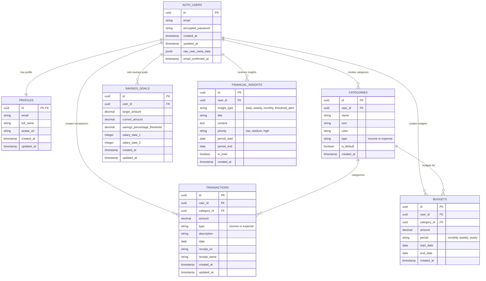

# Wealth Well Organizer - Entity Relationship Diagram

## Database Schema Overview

The wealth-well-organizer uses a PostgreSQL database with Supabase for backend services. The schema includes 6 main tables with proper relationships and Row Level Security (RLS) policies.

## Mermaid ERD Code

## Table Descriptions

### 1. **AUTH_USERS** (Supabase Built-in)
- **Purpose**: Handles user authentication and authorization
- **Features**: Email/password auth, OAuth providers, JWT tokens
- **Security**: Managed by Supabase Auth

### 2. **PROFILES** 
- **Purpose**: Extended user profile information
- **Relationship**: 1:1 with AUTH_USERS
- **Features**: Display name, avatar, email copy
- **RLS**: Users can only view/edit their own profile

### 3. **CATEGORIES**
- **Purpose**: Transaction categorization system
- **Types**: Income (salary, freelance, investments) or Expense (food, transport, etc.)
- **Features**: Custom colors, icons, default categories
- **RLS**: Users see their own + default categories

### 4. **TRANSACTIONS**
- **Purpose**: Core financial transaction records
- **Features**: Amount, type, description, date, receipt attachments
- **Relationships**: Links to categories and users
- **RLS**: Users only see their own transactions

### 5. **BUDGETS**
- **Purpose**: Budget management and tracking
- **Features**: Category-based budgets, time periods, amount limits
- **Relationships**: Links to categories and users
- **RLS**: Users only see their own budgets

### 6. **SAVINGS_GOALS**
- **Purpose**: Savings goal tracking and management
- **Features**: Target amounts, current progress, salary dates, thresholds
- **AI Integration**: Triggers threshold alerts
- **RLS**: Users only see their own goals

### 7. **FINANCIAL_INSIGHTS**
- **Purpose**: AI-generated financial advice and alerts
- **Types**: Daily, weekly, monthly insights, threshold alerts
- **Features**: Priority levels, read status, time periods
- **RLS**: Users only see their own insights

## Key Features

### 🔐 **Security**
- **Row Level Security (RLS)** on all tables
- **User isolation** - users only access their own data
- **JWT-based authentication** via Supabase Auth

### 🔄 **Relationships**
- **One-to-One**: User → Profile
- **One-to-Many**: User → Categories, Transactions, Budgets, Goals, Insights
- **Many-to-One**: Transactions → Categories, Budgets → Categories

### 📊 **Data Integrity**
- **Foreign Key Constraints** maintain referential integrity
- **Check Constraints** on transaction types and budget periods
- **NOT NULL constraints** on critical fields

### 🎯 **Business Logic**
- **Default Categories** provided for new users
- **Automated Insights** generated based on transaction patterns
- **Threshold Alerts** for savings goals
- **Receipt Storage** via Supabase Storage

### 📈 **Scalability**
- **UUID Primary Keys** for distributed systems
- **Indexed Foreign Keys** for query performance
- **Timestamp Tracking** for audit trails
- **Soft Delete Capability** (via updated_at)

## Usage in Application

### **Dashboard Stats**
- Aggregates data from transactions, categories, and savings_goals
- Real-time calculations for income, expenses, and savings rates

### **AI Insights**
- Analyzes transaction patterns to generate insights
- Monitors savings goals and triggers alerts
- Provides personalized financial recommendations

### **Reporting**
- Cross-table queries for comprehensive financial reports
- Category-based spending analysis
- Time-series data for trend analysis

### **Budget Management**
- Links budgets to specific categories
- Tracks spending against budget limits
- Provides budget vs. actual comparisons

---

**Database**: PostgreSQL (via Supabase)  
**ORM**: Supabase Client with TypeScript  
**Security**: Row Level Security (RLS) + JWT Auth  
**Storage**: Supabase Storage for receipts  
**Real-time**: Supabase Realtime for live updates